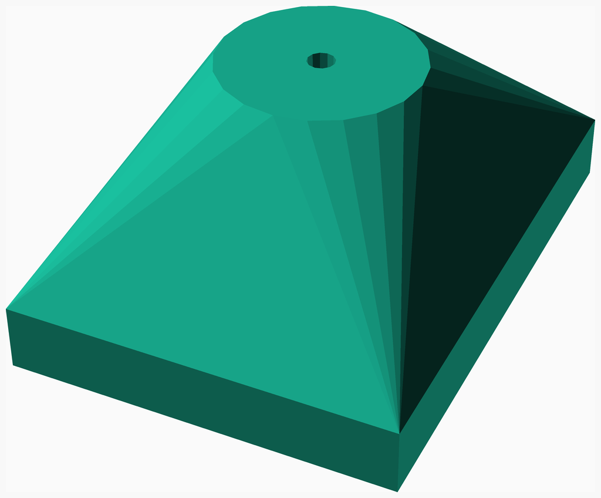
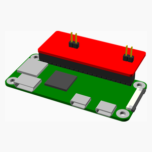
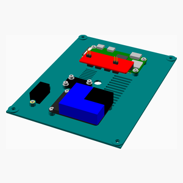

# Weather Stn
An anaerometer and atmospheric sampling station based on RasPi Zero W.

---
## Table of Contents
1. [Parts list](#Parts_list)
1. [Housing Assembly](#housing_assembly)
1. [Pi Assembly](#pi_assembly)
1. [Plate Assembly](#plate_assembly)
1. [Spinner Assembly](#spinner_assembly)
1. [Main Assembly](#main_assembly)

[Top](#TOP)

---

## Parts list
| Housing | Pi | Plate | Spinner | Main | TOTALS |  |
|---:|---:|---:|---:|---:|---:|:---|
|  |  |  |  |  | | **Vitamins** |
| &nbsp;&nbsp;.&nbsp; | &nbsp;&nbsp;.&nbsp; | &nbsp;&nbsp;1&nbsp; | &nbsp;&nbsp;.&nbsp; | &nbsp;&nbsp;.&nbsp; |  &nbsp;&nbsp;1&nbsp; | &nbsp;&nbsp; BME680 Atmospheric Sensor STEMMA-QT |
| &nbsp;&nbsp;.&nbsp; | &nbsp;&nbsp;.&nbsp; | &nbsp;&nbsp;.&nbsp; | &nbsp;&nbsp;1&nbsp; | &nbsp;&nbsp;.&nbsp; |  &nbsp;&nbsp;1&nbsp; | &nbsp;&nbsp; Ball bearing 608-2RS 8mm x 22mm x 7mm |
| &nbsp;&nbsp;1&nbsp; | &nbsp;&nbsp;.&nbsp; | &nbsp;&nbsp;.&nbsp; | &nbsp;&nbsp;.&nbsp; | &nbsp;&nbsp;.&nbsp; |  &nbsp;&nbsp;1&nbsp; | &nbsp;&nbsp; Hall Effect Sensor |
| &nbsp;&nbsp;5&nbsp; | &nbsp;&nbsp;.&nbsp; | &nbsp;&nbsp;13&nbsp; | &nbsp;&nbsp;.&nbsp; | &nbsp;&nbsp;.&nbsp; |  &nbsp;&nbsp;18&nbsp; | &nbsp;&nbsp; Heatfit insert M2.5 |
| &nbsp;&nbsp;.&nbsp; | &nbsp;&nbsp;.&nbsp; | &nbsp;&nbsp;.&nbsp; | &nbsp;&nbsp;1&nbsp; | &nbsp;&nbsp;.&nbsp; |  &nbsp;&nbsp;1&nbsp; | &nbsp;&nbsp; Magnet, 5mm diameter, 1mm high |
| &nbsp;&nbsp;.&nbsp; | &nbsp;&nbsp;1&nbsp; | &nbsp;&nbsp;.&nbsp; | &nbsp;&nbsp;.&nbsp; | &nbsp;&nbsp;.&nbsp; |  &nbsp;&nbsp;1&nbsp; | &nbsp;&nbsp; Micro SD card |
| &nbsp;&nbsp;.&nbsp; | &nbsp;&nbsp;.&nbsp; | &nbsp;&nbsp;1&nbsp; | &nbsp;&nbsp;.&nbsp; | &nbsp;&nbsp;.&nbsp; |  &nbsp;&nbsp;1&nbsp; | &nbsp;&nbsp; Micro USB Panel Jack |
| &nbsp;&nbsp;.&nbsp; | &nbsp;&nbsp;.&nbsp; | &nbsp;&nbsp;1&nbsp; | &nbsp;&nbsp;.&nbsp; | &nbsp;&nbsp;.&nbsp; |  &nbsp;&nbsp;1&nbsp; | &nbsp;&nbsp; PMSA003I Air Particulate Sensor STEMMA-QT |
| &nbsp;&nbsp;.&nbsp; | &nbsp;&nbsp;2&nbsp; | &nbsp;&nbsp;.&nbsp; | &nbsp;&nbsp;.&nbsp; | &nbsp;&nbsp;.&nbsp; |  &nbsp;&nbsp;2&nbsp; | &nbsp;&nbsp; Pin header 2 x 1 |
| &nbsp;&nbsp;.&nbsp; | &nbsp;&nbsp;1&nbsp; | &nbsp;&nbsp;.&nbsp; | &nbsp;&nbsp;.&nbsp; | &nbsp;&nbsp;.&nbsp; |  &nbsp;&nbsp;1&nbsp; | &nbsp;&nbsp; Pin header 20 x 2 |
| &nbsp;&nbsp;.&nbsp; | &nbsp;&nbsp;1&nbsp; | &nbsp;&nbsp;.&nbsp; | &nbsp;&nbsp;.&nbsp; | &nbsp;&nbsp;.&nbsp; |  &nbsp;&nbsp;1&nbsp; | &nbsp;&nbsp; Raspberry Pi Zero |
| &nbsp;&nbsp;.&nbsp; | &nbsp;&nbsp;.&nbsp; | &nbsp;&nbsp;11&nbsp; | &nbsp;&nbsp;.&nbsp; | &nbsp;&nbsp;.&nbsp; |  &nbsp;&nbsp;11&nbsp; | &nbsp;&nbsp; Screw M2.5 cap x  5mm |
| &nbsp;&nbsp;.&nbsp; | &nbsp;&nbsp;.&nbsp; | &nbsp;&nbsp;.&nbsp; | &nbsp;&nbsp;.&nbsp; | &nbsp;&nbsp;4&nbsp; |  &nbsp;&nbsp;4&nbsp; | &nbsp;&nbsp; Screw M2.5 cap x  7mm |
| &nbsp;&nbsp;.&nbsp; | &nbsp;&nbsp;.&nbsp; | &nbsp;&nbsp;2&nbsp; | &nbsp;&nbsp;.&nbsp; | &nbsp;&nbsp;1&nbsp; |  &nbsp;&nbsp;3&nbsp; | &nbsp;&nbsp; Screw M2.5 cap x 15mm |
| &nbsp;&nbsp;.&nbsp; | &nbsp;&nbsp;.&nbsp; | &nbsp;&nbsp;.&nbsp; | &nbsp;&nbsp;.&nbsp; | &nbsp;&nbsp;1&nbsp; |  &nbsp;&nbsp;1&nbsp; | &nbsp;&nbsp; Smooth rod 8mm x 200mm |
| &nbsp;&nbsp;.&nbsp; | &nbsp;&nbsp;1&nbsp; | &nbsp;&nbsp;.&nbsp; | &nbsp;&nbsp;.&nbsp; | &nbsp;&nbsp;.&nbsp; |  &nbsp;&nbsp;1&nbsp; | &nbsp;&nbsp; SparkFun Qwiic HAT |
| &nbsp;&nbsp;6&nbsp; | &nbsp;&nbsp;6&nbsp; | &nbsp;&nbsp;29&nbsp; | &nbsp;&nbsp;2&nbsp; | &nbsp;&nbsp;6&nbsp; | &nbsp;&nbsp;49&nbsp; | &nbsp;&nbsp;Total vitamins count |
|  |  |  |  |  | | **3D printed parts** |
| &nbsp;&nbsp;1&nbsp; | &nbsp;&nbsp;.&nbsp; | &nbsp;&nbsp;.&nbsp; | &nbsp;&nbsp;.&nbsp; | &nbsp;&nbsp;.&nbsp; |  &nbsp;&nbsp;1&nbsp; | &nbsp;&nbsp;housing.stl |
| &nbsp;&nbsp;.&nbsp; | &nbsp;&nbsp;.&nbsp; | &nbsp;&nbsp;1&nbsp; | &nbsp;&nbsp;.&nbsp; | &nbsp;&nbsp;.&nbsp; |  &nbsp;&nbsp;1&nbsp; | &nbsp;&nbsp;plate.stl |
| &nbsp;&nbsp;.&nbsp; | &nbsp;&nbsp;.&nbsp; | &nbsp;&nbsp;.&nbsp; | &nbsp;&nbsp;1&nbsp; | &nbsp;&nbsp;.&nbsp; |  &nbsp;&nbsp;1&nbsp; | &nbsp;&nbsp;spinner.stl |
| &nbsp;&nbsp;1&nbsp; | &nbsp;&nbsp;.&nbsp; | &nbsp;&nbsp;1&nbsp; | &nbsp;&nbsp;1&nbsp; | &nbsp;&nbsp;.&nbsp; | &nbsp;&nbsp;3&nbsp; | &nbsp;&nbsp;Total 3D printed parts count |

[Top](#TOP)

---

## Housing Assembly
### Vitamins
|Qty|Description|
|---:|:----------|
|1| Hall Effect Sensor|
|5| Heatfit insert M2.5|

### 3D Printed parts

| 1 x housing.stl |
|---|
|  

### Assembly instructions

Heat-set inserts into the four plate mounting lugs and into the rod retaining lug.

[Top](#TOP)

---

## Pi Assembly
### Vitamins
|Qty|Description|
|---:|:----------|
|1| Micro SD card|
|2| Pin header 2 x 1|
|1| Pin header 20 x 2|
|1| Raspberry Pi Zero|
|1| SparkFun Qwiic HAT|

### Assembly instructions

[Top](#TOP)

---

## Plate Assembly
### Vitamins
|Qty|Description|
|---:|:----------|
|1| BME680 Atmospheric Sensor STEMMA-QT|
|13| Heatfit insert M2.5|
|1| Micro USB Panel Jack|
|1| PMSA003I Air Particulate Sensor STEMMA-QT|
|11| Screw M2.5 cap x  5mm|
|2| Screw M2.5 cap x 15mm|

### 3D Printed parts

| 1 x plate.stl |
|---|
|  

### Sub-assemblies

| 1 x pi_assembly |
|---|
|  

### Assembly instructions

Insert the heat-set inserts.  
Mount the components.  
Mount the panel-mount USB connector, and connect to the RPi0.  
Connect the components using STEMMA-QT cables.  

[Top](#TOP)

---

## Spinner Assembly
### Vitamins
|Qty|Description|
|---:|:----------|
|1| Ball bearing 608-2RS 8mm x 22mm x 7mm|
|1| Magnet, 5mm diameter, 1mm high|

### 3D Printed parts

| 1 x spinner.stl |
|---|
|  

### Assembly instructions

Press-fit the skate bearing into the anemometer spinner.  
Epoxy or glue the magnet into the magnet void.  

[Top](#TOP)

---

## Main Assembly
### Vitamins
|Qty|Description|
|---:|:----------|
|4| Screw M2.5 cap x  7mm|
|1| Screw M2.5 cap x 15mm|
|1| Smooth rod 8mm x 200mm|

### Sub-assemblies

| 1 x housing_assembly | 1 x plate_assembly | 1 x spinner_assembly |
|---|---|---|
|  |  |  

### Assembly instructions

Assembly instructions  
Mount the anemometer spinner on top of the mounting rod.  
Slide the housing up the rod and mount with an M2.5x15 screw.  
Connect the hall effect sensor to the RasPI.  
Mate the PCB base to the housing using M2.5x5 screws.  

[Top](#TOP)
